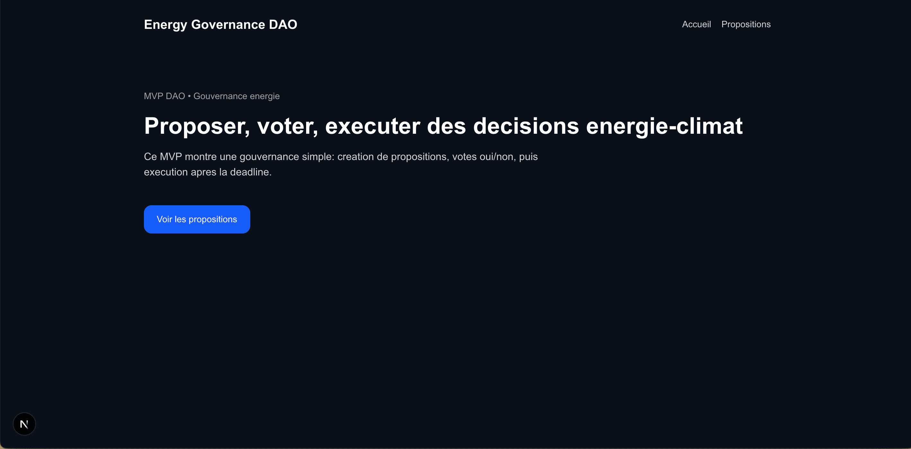
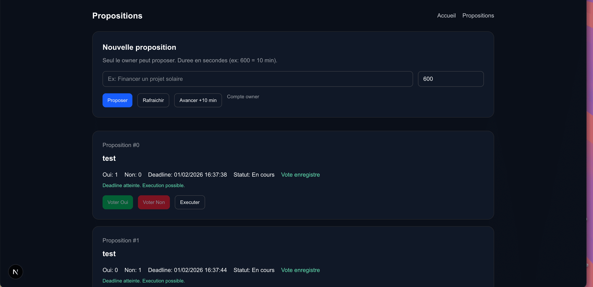

# Energy-Governance-DAO (MVP)

MVP d'une DAO de gouvernance energie/climat. Le owner cree des propositions,
les membres votent, et une proposition peut etre executee apres la deadline.

## Fonctionnalites
- Creation de propositions par le owner
- Vote oui/non par les membres
- Execution apres deadline
- UI simple pour proposer, voter, executer
- Fast-forward local pour gagner du temps en dev

## Stack
- Solidity + Hardhat (backend)
- Next.js + Ethers v6 (frontend)
- MetaMask + Hardhat Local (31337)

## Structure
- `backend/` smart contract, tests, scripts
- `frontend/` UI Next.js (App Router)

## Lancer en local

### 1) Backend
```bash
cd backend
npm install
npx hardhat node
```

Dans un second terminal :
```bash
cd backend
npx hardhat run scripts/deploy.ts --network localhost
```

### 2) Frontend
Mets a jour l'adresse du contrat dans :
`frontend/src/app/proposals/page.tsx`
```ts
const DAO_ADDRESS = "0x...";
```

Puis :
```bash
cd frontend
npm install
npm run dev
```

Ouvre http://localhost:3000/proposals

## Utilisation rapide
1) Proposer (compte owner)
2) Voter avec un autre compte
3) Avancer le temps (bouton "Avancer +10 min")
4) Executer avec le owner

## Tests
```bash
cd backend
npx hardhat test
```

## Screenshots
Ajoute tes captures ici :
- `docs/screenshots/`

Exemple de tableau (remplace les noms de fichiers) :

| Ecran | Apercu |
| --- | --- |
| Accueil |  |
| Propositions |  |

## Ce que tu peux dire aux recruteurs
- DAO minimaliste mais complete (proposer, voter, executer)
- Regles on-chain claires (owner, deadline, anti double vote)
- Frontend connecte a MetaMask et au contrat
- UX pensee pour le dev local (fast-forward)
